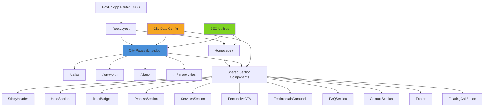
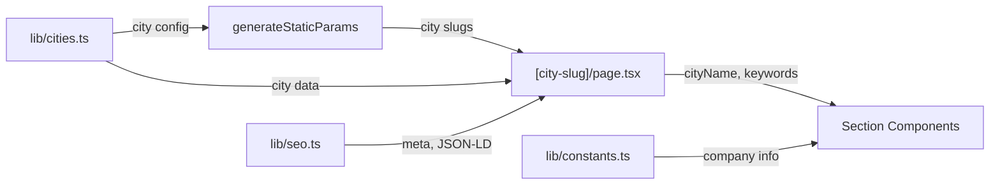

# Design Document: Emergency Plumbing Website

## Overview

A multi-page lead generation website for 24/7 emergency plumbing services across the DFW metroplex. The site uses a data-driven architecture where city-specific content is generated from a centralized configuration, enabling 10 city landing pages plus a homepage from shared components and city data objects.

The architecture prioritizes:
- Static generation (SSG) for maximum SEO performance and Vercel edge caching
- Data-driven city pages generated from a single city configuration array
- Comprehensive structured data (JSON-LD) for SEO, AIO, and GEO
- Component reuse across homepage and city pages with city-aware props
- Aceternity UI for visual impact, shadcn/ui for interactive elements

## Architecture

### High-Level Architecture



### Data Flow



### Technology Stack

| Layer | Technology | Purpose |
|-------|-----------|---------|
| Framework | Next.js 15 (App Router) | SSG, dynamic routes, metadata API |
| Animations | Aceternity UI + Framer Motion | Spotlight, text effects, moving borders, infinite cards |
| UI Components | shadcn/ui | Buttons, forms, cards, inputs, accordion (FAQ) |
| Styling | Tailwind CSS v4 | Layout, responsive design, color system |
| Validation | Zod | Contact form schema validation |
| Icons | Lucide React | Service icons, UI icons |
| Language | TypeScript | Type safety |
| Deployment | Vercel | Hosting, edge CDN, SSG |

### Project Structure

```
src/
├── app/
│   ├── layout.tsx                    # Root layout with fonts, metadata, StickyHeader, Footer
│   ├── page.tsx                      # Homepage (DFW-wide)
│   ├── [city-slug]/
│   │   └── page.tsx                  # City-specific landing page (SSG)
│   ├── sitemap.ts                    # Dynamic sitemap generation
│   ├── robots.ts                     # robots.txt generation
│   └── globals.css                   # Tailwind imports, CSS variables
├── components/
│   ├── ui/                           # shadcn/ui components
│   ├── aceternity/                   # Aceternity UI components
│   ├── sections/
│   │   ├── hero-section.tsx
│   │   ├── trust-badges.tsx
│   │   ├── process-section.tsx
│   │   ├── services-section.tsx
│   │   ├── persuasive-cta.tsx
│   │   ├── testimonials-carousel.tsx
│   │   ├── faq-section.tsx
│   │   └── contact-section.tsx
│   ├── sticky-header.tsx
│   ├── floating-call-button.tsx
│   └── footer.tsx
├── lib/
│   ├── utils.ts                      # cn() utility
│   ├── validation.ts                 # Zod schemas for contact form
│   ├── constants.ts                  # Company info, services, testimonials
│   ├── cities.ts                     # City configurations with keywords, FAQs
│   └── seo.ts                        # Meta generation, JSON-LD builders
└── types/
    └── index.ts                      # Shared TypeScript types
```

## Components and Interfaces

### City Data Configuration

The core data structure driving all city pages:

```typescript
// types/index.ts
export interface CityConfig {
  slug: string;              // URL slug: "plano", "fort-worth"
  name: string;              // Display name: "Plano", "Fort Worth"
  county: string;            // "Collin County", "Tarrant County"
  metaTitle: string;         // SEO meta title
  metaDescription: string;   // SEO meta description
  heroHeadline: string;      // "24/7 Emergency Plumber in Plano"
  heroSubheadline: string;   // "Fast response across Plano — trucks arrive in 30 minutes"
  faqs: FAQ[];               // City-specific FAQ items (5+)
  nearbyAreas: string[];     // Nearby neighborhoods/areas for content
}

export interface FAQ {
  question: string;
  answer: string;
}

export interface Service {
  icon: string;
  title: string;
  description: string;
  slug: string;              // For internal linking: "burst-pipe-repair"
}

export interface Testimonial {
  name: string;
  rating: number;
  text: string;
  city: string;              // Which city the review is from
}

export interface ProcessStep {
  stepNumber: number;
  icon: string;
  title: string;
  description: string;
}

export interface ContactFormData {
  name: string;
  phone: string;
  email: string;
  message: string;
}
```

### Page Components

#### 1. RootLayout (`app/layout.tsx`)

```typescript
// Wraps all pages with:
// - Inter font from next/font/google
// - Global metadata defaults (Open Graph, Twitter Card)
// - StickyHeader component
// - Footer component
// - FloatingCallButton component
// - <html lang="en"> with proper semantic structure
```

#### 2. Homepage (`app/page.tsx`)

```typescript
// Static page targeting DFW-wide keywords
// Metadata: "DFW Emergency Plumber | 24/7 Fast Response | [Company]"
// Sections: Hero (DFW-wide), TrustBadges, Process, Services, PersuasiveCTA,
//           Testimonials, FAQ (DFW-general), Contact
// Includes JSON-LD: LocalBusiness (DFW service area), FAQPage, Service
// Links to all 10 city pages in a "Service Areas" section
```

#### 3. City Page (`app/[city-slug]/page.tsx`)

```typescript
// SSG via generateStaticParams() returning all 10 city slugs
// Receives city config from lib/cities.ts based on slug
// Metadata: city-specific meta title and description
// All section components receive cityName prop for content injection
// Includes JSON-LD: LocalBusiness (city-specific), FAQPage, Service
// generateMetadata() builds city-specific Open Graph tags
```

### Section Components

#### 4. StickyHeader

```typescript
// Fixed position header (z-50)
// Left: Company logo (text-based with Lucide wrench icon)
// Center: Navigation dropdown "Service Areas" linking to all 10 city pages
// Right: Tracking number as tel: link + "Call Now" Button (shadcn/ui, red accent)
// Backdrop blur + semi-transparent background on scroll
// Mobile: hamburger menu for nav, compact call button
```

#### 5. HeroSection

```typescript
interface HeroSectionProps {
  cityName?: string;  // undefined for homepage
}
// Aceternity Spotlight component for animated background effect
// h1: "24/7 Emergency Plumber in {cityName}" or "24/7 Emergency Plumber in DFW"
// Subheadline with response time, includes city name if provided
// Primary CTA: "Call Now" button with tracking number (shadcn/ui Button, destructive)
// Secondary CTA: "Get a Free Quote" anchor to contact section
```

#### 6. TrustBadges

```typescript
// Horizontal row of 4 badges: Google Reviews (4.9★), BBB A+ Rating, Licensed & Insured, 30-Min Response
// shadcn/ui Card for each badge
// Framer Motion fade-in animation on scroll
// Responsive: 2x2 grid on mobile, 4-column on desktop
```

#### 7. ProcessSection

```typescript
// 4 steps: Call Us → We Arrive Fast → Action Plan → Job Done
// Each step: numbered circle + Lucide icon + title + description
// Aceternity MovingBorder on step cards
// CTA with tracking number below steps
// Responsive: vertical stack on mobile, horizontal on desktop
```

#### 8. ServicesSection

```typescript
interface ServicesSectionProps {
  cityName?: string;
}
// 8 service cards: Burst Pipe Repair, Drain Cleaning, Water Heater Repair,
//   Leak Detection, Sewer Repair, Toilet Repair, Gas Line Repair, Garbage Disposal Repair
// Each card: Lucide icon + title (with city name if provided) + description
// shadcn/ui Card with hover effects
// Responsive grid: 1 col mobile, 2 col tablet, 4 col desktop
// CTA with tracking number below grid
```

#### 9. PersuasiveCTA

```typescript
interface PersuasiveCTAProps {
  headline: string;
  body: string;
  cityName?: string;
  variant: "problem" | "nearme";
}
// Full-width section with Aceternity LampEffect or gradient background
// Large headline, persuasive body copy with city name injected
// Prominent "Call Now" button with tracking number
// Used twice: "Ready to take care of your plumbing problem?" and "Need urgent plumbers near me?"
```

#### 10. TestimonialsCarousel

```typescript
// Aceternity InfiniteMovingCards for auto-scrolling
// Each card: reviewer name, star rating (filled/empty stars), review text, city
// Minimum 6 testimonials (mix of cities)
// shadcn/ui Card styling for each testimonial
```

#### 11. FAQSection

```typescript
interface FAQSectionProps {
  faqs: FAQ[];
  cityName?: string;
}
// shadcn/ui Accordion component for expandable Q&A
// 5+ questions per page, city-specific content
// Questions target common search queries:
//   "How much does an emergency plumber cost in [city]?"
//   "How fast can a plumber get to my house in [city]?"
//   "What plumbing emergencies do you handle in [city]?"
//   "Do you serve [nearby areas]?"
//   "Are you available 24/7 in [city]?"
// Semantic HTML: <details>/<summary> or proper ARIA for accessibility
```

#### 12. ContactSection

```typescript
// Two-column layout: form on left, info on right
// Form: name, phone, email, message fields (shadcn/ui Input, Textarea)
// Zod validation with inline error messages
// Submit button disabled until valid (shadcn/ui Button)
// Right column: tracking number (large, clickable), services list, "Available 24/7" badge
// Form submission: client-side only for now (no backend), shows success toast
```

#### 13. FloatingCallButton

```typescript
// Visible only below md breakpoint (mobile/tablet)
// Fixed bottom-center, z-50
// shadcn/ui Button with red/orange background
// Phone icon + "Call Now" text
// Links to tel: tracking number
```

#### 14. Footer

```typescript
// 4-column layout (desktop), stacked (mobile)
// Col 1: Company logo, tagline, tracking number
// Col 2: "Service Areas" — links to all 10 city pages
// Col 3: "Services" — links to service anchors (internal linking)
// Col 4: "Contact" — phone, email, 24/7 availability
// Bottom bar: copyright, privacy policy link
```

### SEO Utilities

#### Meta Generation (`lib/seo.ts`)

```typescript
// generateCityMetadata(city: CityConfig): Metadata
//   - Returns Next.js Metadata object with title, description, openGraph, twitter
//   - City-specific Open Graph image alt text
//   - Canonical URL

// generateLocalBusinessJsonLd(city?: CityConfig): object
//   - LocalBusiness schema with name, phone, address, serviceArea, openingHours: 24/7
//   - City-specific areaServed if city provided, DFW-wide if not

// generateFAQJsonLd(faqs: FAQ[]): object
//   - FAQPage schema from FAQ array

// generateServiceJsonLd(services: Service[]): object
//   - Service schema array for each plumbing service
```

#### Sitemap (`app/sitemap.ts`)

```typescript
// Next.js sitemap generation
// Lists: homepage + all 10 city pages
// Priority: homepage 1.0, city pages 0.9
// changeFrequency: "weekly"
```

#### Robots (`app/robots.ts`)

```typescript
// Allow all crawlers
// Reference sitemap URL
```

## Data Models

### Contact Form Validation Schema

```typescript
import { z } from "zod";

export const contactFormSchema = z.object({
  name: z.string().min(1, "Name is required").max(100, "Name is too long"),
  phone: z.string()
    .min(1, "Phone number is required")
    .regex(
      /^\+?[\d\s\-\(\)]{7,15}$/,
      "Please enter a valid phone number (e.g., (555) 123-4567)"
    ),
  email: z.string()
    .min(1, "Email is required")
    .email("Please enter a valid email address"),
  message: z.string()
    .min(1, "Message is required")
    .max(1000, "Message is too long"),
});

export type ContactFormData = z.infer<typeof contactFormSchema>;
```

### City Configuration Data

```typescript
// lib/cities.ts
export const DFW_CITIES: CityConfig[] = [
  {
    slug: "dallas",
    name: "Dallas",
    county: "Dallas County",
    metaTitle: "Dallas Emergency Plumber | 24/7 Fast Response | FastFlow Plumbing",
    metaDescription: "Need an emergency plumber in Dallas? FastFlow Plumbing offers 24/7 service with 30-minute response times. Call now for burst pipes, drain cleaning, leak detection & more.",
    heroHeadline: "24/7 Emergency Plumber in Dallas",
    heroSubheadline: "Fast response across Dallas — our trucks arrive within 30 minutes",
    faqs: [
      { question: "How much does an emergency plumber cost in Dallas?", answer: "Emergency plumbing rates in Dallas typically range from $150-$500 depending on the issue. We provide upfront pricing with no hidden fees before any work begins." },
      { question: "How fast can a plumber get to my house in Dallas?", answer: "Our Dallas plumbing trucks are dispatched 24/7 and typically arrive within 30 minutes of your call." },
      // ... 3+ more
    ],
    nearbyAreas: ["Uptown", "Deep Ellum", "Oak Lawn", "Highland Park", "Lake Highlands"],
  },
  // ... 9 more cities
];
```

### Constants

```typescript
// lib/constants.ts
export const COMPANY = {
  name: "FastFlow Plumbing",
  phone: "(555) 123-4567",
  phoneHref: "tel:+15551234567",
  tagline: "24/7 Emergency Plumbing Services",
  responseTime: "30 minutes",
  domain: "https://fastflowplumbing.com",
} as const;

export const SERVICES: Service[] = [
  { icon: "Pipette", title: "Burst Pipe Repair", description: "Fast response for burst and broken pipes to minimize water damage.", slug: "burst-pipe-repair" },
  { icon: "Waves", title: "Drain Cleaning", description: "Professional drain cleaning to clear stubborn clogs and blockages.", slug: "drain-cleaning" },
  { icon: "Flame", title: "Water Heater Repair", description: "Expert water heater diagnosis and repair — tank and tankless.", slug: "water-heater-repair" },
  { icon: "Search", title: "Leak Detection", description: "Advanced leak detection to find hidden leaks before they cause damage.", slug: "leak-detection" },
  { icon: "Construction", title: "Sewer Repair", description: "Sewer line repair and replacement using modern trenchless methods.", slug: "sewer-repair" },
  { icon: "Bath", title: "Toilet Repair", description: "Toilet repair and replacement for clogs, leaks, and running toilets.", slug: "toilet-repair" },
  { icon: "Fuel", title: "Gas Line Repair", description: "Licensed gas line repair for leaks and installations — safety first.", slug: "gas-line-repair" },
  { icon: "Trash2", title: "Garbage Disposal Repair", description: "Garbage disposal repair and replacement to keep your kitchen running.", slug: "garbage-disposal-repair" },
];

export const TESTIMONIALS: Testimonial[] = [
  { name: "John M.", rating: 5, text: "Called at 2 AM for a burst pipe. They were at my door in 25 minutes. Incredible service.", city: "Dallas" },
  { name: "Sarah K.", rating: 5, text: "Professional, fast, and fair pricing. Fixed our water heater the same day.", city: "Plano" },
  { name: "Mike R.", rating: 5, text: "Best emergency plumber in Fort Worth. They saved us from a major flood.", city: "Fort Worth" },
  { name: "Lisa T.", rating: 5, text: "Arrived quickly and fixed our clogged drain. Very reasonable price.", city: "Arlington" },
  { name: "David W.", rating: 5, text: "Excellent leak detection service. Found the problem fast and fixed it right.", city: "Frisco" },
  { name: "Jennifer P.", rating: 5, text: "24/7 availability is a lifesaver. Called on a Sunday and they came right out.", city: "Irving" },
];

export const PROCESS_STEPS: ProcessStep[] = [
  { stepNumber: 1, icon: "Phone", title: "Call Us", description: "Call our 24/7 emergency line. We answer immediately." },
  { stepNumber: 2, icon: "Truck", title: "We Arrive Fast", description: "A licensed plumber arrives at your door within 30 minutes." },
  { stepNumber: 3, icon: "ClipboardList", title: "Action Plan", description: "We diagnose the issue and give you an upfront price — no surprises." },
  { stepNumber: 4, icon: "CheckCircle", title: "Job Done", description: "We fix the problem right the first time. Guaranteed." },
];
```

### Color System

```
Primary:     Blue (#1E40AF / blue-800) — trust, professionalism
Secondary:   White (#FFFFFF) — clean backgrounds
Accent:      Red-Orange (#DC2626 / red-600) — CTAs, emergency emphasis
Surface:     Slate-50 (#F8FAFC) — alternating section backgrounds
Text:        Slate-900 for headings, Slate-600 for body
Border:      Slate-200 for card borders
```


## Correctness Properties

*A property is a characteristic or behavior that should hold true across all valid executions of a system — essentially, a formal statement about what the system should do. Properties serve as the bridge between human-readable specifications and machine-verifiable correctness guarantees.*

### Property 1: City page routing and sitemap coverage

*For any* city in the DFW_Cities configuration, `generateStaticParams` should return that city's slug, and the generated sitemap should contain a URL for that city's page.

**Validates: Requirements 1.2, 1.5**

### Property 2: City name injection in page content

*For any* city configuration, when the city page sections are rendered with that city's name, the h1 heading should contain the city name, the services section should reference the city name in service titles, and the persuasive CTA sections should include the city name in their copy.

**Validates: Requirements 1.3, 4.2, 7.4, 8.3**

### Property 3: City-specific metadata generation

*For any* city configuration, the generated metadata should produce a title containing the city name following the pattern "[City] Emergency Plumber | 24/7 Fast Response | [Company]", and a description containing the city name, at least one service keyword, and a call-to-action phrase.

**Validates: Requirements 2.1, 2.2**

### Property 4: City-specific JSON-LD generation

*For any* city configuration, the generated JSON-LD should include a LocalBusiness object with the city's name in the areaServed field, and a FAQPage object whose questions and answers match the city's FAQ data.

**Validates: Requirements 2.4, 2.5**

### Property 5: Service JSON-LD generation

*For any* service in the services list, the generated Service JSON-LD should contain the service name and description matching the source data.

**Validates: Requirements 2.6**

### Property 6: FAQ data completeness

*For any* city in the DFW_Cities configuration, the city's FAQ array should contain at least 5 items, and each FAQ item should have a non-empty question and a non-empty answer.

**Validates: Requirements 2.8**

### Property 7: Testimonial rendering completeness

*For any* testimonial object with a name, rating (1–5), and text, the rendered testimonial card output should contain the reviewer's name, a visual representation of the star rating, and the full review text.

**Validates: Requirements 9.1**

### Property 8: Valid contact form data passes validation

*For any* contact form input where name is a non-empty string (≤100 chars), phone matches the pattern `^\+?[\d\s\-\(\)]{7,15}$`, email is a valid email format, and message is a non-empty string (≤1000 chars), the Zod schema validation should succeed with no errors.

**Validates: Requirements 13.3**

### Property 9: Invalid contact form data fails with field-specific errors

*For any* contact form input where at least one field is invalid (empty name, phone not matching format, email not matching format, empty message, or name/message exceeding length limits), the Zod schema validation should fail and the error result should identify the specific invalid field(s).

**Validates: Requirements 10.2, 10.3, 13.1, 13.2**

## Error Handling

### Contact Form Errors

| Error Scenario | Handling |
|---------------|----------|
| Empty required field | Inline error message below the field, field highlighted with red border |
| Invalid phone format | Inline error: "Please enter a valid phone number (e.g., (555) 123-4567)" |
| Invalid email format | Inline error: "Please enter a valid email address" |
| Name too long (>100 chars) | Inline error: "Name is too long" |
| Message too long (>1000 chars) | Inline error: "Message is too long" |
| Network error on submit | Toast/banner: "Something went wrong. Please try again or call us directly at (555) 123-4567." Form data retained. |

### General Error Handling

- All tel: links use standard HTML anchor elements — no JS error handling needed
- Aceternity UI animation components gracefully degrade if Framer Motion fails (components render without animation)
- City page with invalid slug returns Next.js 404 via `notFound()` in the page component
- JSON-LD generation handles missing optional fields gracefully with sensible defaults

## Testing Strategy

### Dual Testing Approach

This project uses both unit tests and property-based tests for comprehensive coverage.

**Unit Tests (Vitest + React Testing Library)**:
- Verify each component renders expected elements (tel: links, headings, form fields)
- Test specific user interactions (form submission, navigation)
- Test edge cases (network error on form submit, empty data arrays)
- Test specific rendering examples for homepage and one city page

**Property-Based Tests (fast-check + Vitest)**:
- Verify universal properties across randomly generated inputs
- Minimum 100 iterations per property test
- Each test tagged with: **Feature: emergency-plumbing-website, Property {number}: {title}**
- Each correctness property implemented by a single property-based test

### Property-Based Test Configuration

- Library: [fast-check](https://github.com/dubzzz/fast-check)
- Runner: Vitest
- Iterations: 100 minimum per property
- Generators: custom arbitraries for CityConfig, ContactFormData, Testimonial, Service

### Test Plan

| Property | Test Description | Type |
|----------|-----------------|------|
| Property 1 | For all city configs, verify generateStaticParams and sitemap include them | Property (fast-check) |
| Property 2 | For all city names, verify rendered sections contain city name in h1, services, CTAs | Property (fast-check) |
| Property 3 | For all city configs, verify metadata title/description follow patterns | Property (fast-check) |
| Property 4 | For all city configs, verify LocalBusiness and FAQPage JSON-LD correctness | Property (fast-check) |
| Property 5 | For all services, verify Service JSON-LD contains name and description | Property (fast-check) |
| Property 6 | For all city configs, verify FAQ array has >= 5 items with non-empty Q&A | Property (fast-check) |
| Property 7 | For random testimonials, verify rendered card contains name, rating, text | Property (fast-check) |
| Property 8 | For random valid form data, verify Zod schema passes | Property (fast-check) |
| Property 9 | For random invalid form data, verify Zod schema fails with correct field errors | Property (fast-check) |

### Unit Test Coverage

| Component | Key Tests |
|-----------|-----------|
| StickyHeader | Renders tel: link, logo, CTA button, city nav links |
| HeroSection | Renders h1 with "24/7", subheadline with response time, CTA |
| TrustBadges | Renders Google, BBB, licensing badges |
| ProcessSection | Renders 4+ steps with numbers/icons, CTA |
| ServicesSection | Renders all 8 service cards, CTA |
| PersuasiveCTA | Renders headline, phone CTA (both variants) |
| TestimonialsCarousel | Renders 3+ testimonials |
| FAQSection | Renders accordion with questions, expandable answers |
| ContactSection | Renders form fields, validation errors, phone link, services list, 24/7 messaging |
| FloatingCallButton | Renders on mobile, hidden on desktop |
| Footer | Renders company name, city links, service links, tel: link |
| SEO utilities | Generates correct metadata, JSON-LD for homepage and city pages |
| Sitemap | Includes homepage + all 10 city URLs |
